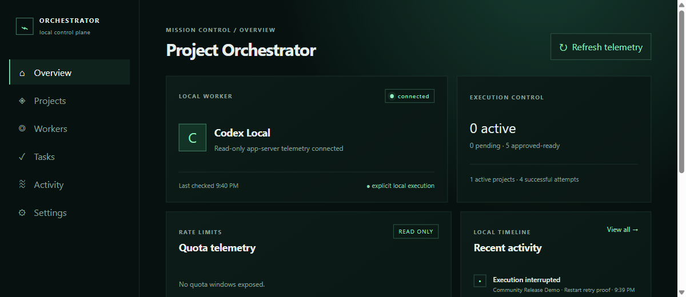

# Project Orchestrator

Project Orchestrator is a Windows-first, local-first desktop control plane for running explicitly approved tasks through a local Codex installation. Version 0.3.0 is an early-access community release: it is useful today, but it is not a cloud, multi-user, or multi-provider orchestration service.



## What it does

- Registers local projects without executing them.
- Keeps drafts, approvals, execution attempts, retries, cancellations, and activity history in local application state.
- Reads local Codex availability, rate-limit telemetry, and the dynamic model/reasoning catalog.
- Runs an approved task only after an explicit **Run** action.
- Defaults every run to **READ ONLY**.
- Offers an explicit **WORKSPACE WRITE** mode limited to the registered project directory.
- Disables network access in the execution sandbox.
- Reconciles interrupted runs after restart without auto-resuming them.

## Safety model

Approval records intent; it does not start Codex. Project Orchestrator derives the execution working directory from the registered canonical project path and does not accept an arbitrary frontend-controlled cwd. READ ONLY is the default. WORKSPACE WRITE can modify the registered workspace, so review the task instruction before pressing Run. Both policies send `networkAccess: false`.

Project Orchestrator does not write Codex authentication or configuration, does not enable unrestricted execution, and does not include cloud telemetry or analytics.

## Prerequisites

- Windows 10 or 11 with Microsoft Edge WebView2 Runtime.
- A local Codex CLI installation available as `codex` on `PATH`.
- For source builds: Node.js 24, npm 11, Rust 1.98 MSVC, and the Microsoft C++ build tools.

The native release candidate resolved and was tested with `codex-cli 0.151.0-alpha.7.2`. Other versions are not claimed as tested. Because this is a prerelease Codex build, compatibility is an early-access limitation and should be revalidated when Codex changes.

## Windows installation

Once the community release is published, download either the MSI or NSIS installer from this repository's GitHub Releases page. The v0.3.0 installers are unsigned unless the release notes explicitly say otherwise, so Windows may show a publisher warning. Verify the published SHA-256 before installing.

## Build from source

```powershell
git clone <repository-url>
cd <repository-directory>
npm ci
npm test
npm run typecheck
npm run build
cargo fmt --manifest-path src-tauri/Cargo.toml -- --check
cargo test --manifest-path src-tauri/Cargo.toml
cargo check --manifest-path src-tauri/Cargo.toml
npm run tauri build -- --bundles msi,nsis
```

For local development:

```powershell
npm ci
npm run tauri dev
```

## First run

1. Read and acknowledge the local-first safety guide.
2. Open **Projects**, choose **Add project**, and register an existing local directory.
3. Open **Tasks**, create a draft, submit it, and approve it.
4. Choose READ ONLY or WORKSPACE WRITE, review model/reasoning selections, then press **Run**.
5. Review the attempt under the task and in **Activity**. Approval alone never starts execution.

The **Settings** page shows the app version, detected local Codex version, application data location, safety summary, and onboarding replay control.

## Local persistence and privacy

The project registry, task instructions, approvals, run summaries, and history are stored in the application-owned data directory shown in Settings. Project paths and task/provider output can be sensitive. Do not publish local state or logs without review. The app does not add analytics or remote error reporting.

## Known limitations

- Windows-first early access; other desktop platforms are not validated for v0.3.0.
- One local Codex worker; no Claude, multi-account routing, automatic failover, or hosted providers.
- No multi-user service, cloud sync, mobile app, or remote control plane.
- Provider output is bounded and summarized; it is not a complete terminal transcript.
- Installers are unsigned unless the release notes explicitly state otherwise.
- Code signing, GitHub publication, and distribution are release-owner operations.

## Community

See [CONTRIBUTING.md](CONTRIBUTING.md), [SECURITY.md](SECURITY.md), the [threat model](docs/threat-model.md), and the [v0.3.0 release contract](docs/release-v0.3.0.md). Changes are recorded in [CHANGELOG.md](CHANGELOG.md).

## License

Project Orchestrator is available under the [MIT License](LICENSE).
